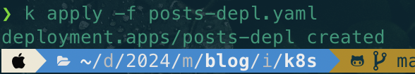
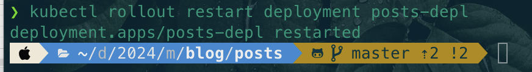
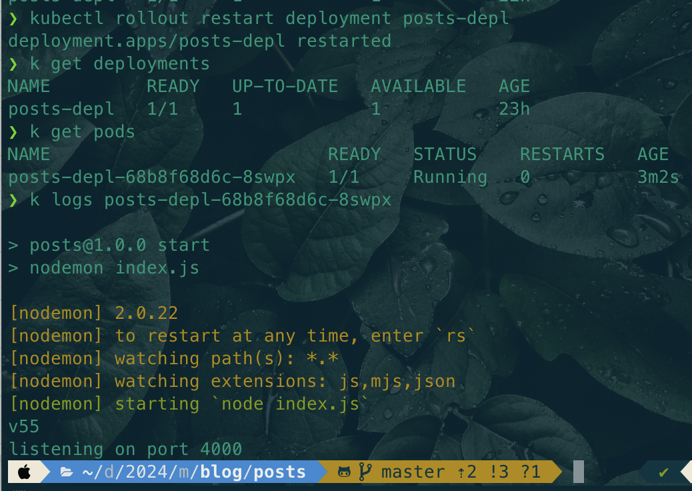
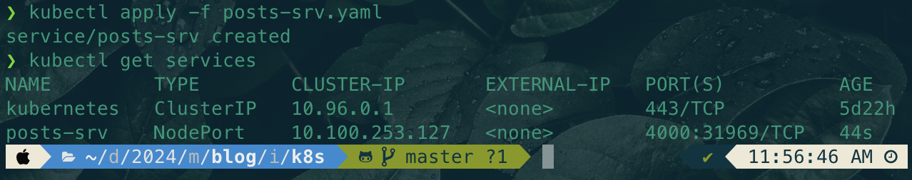
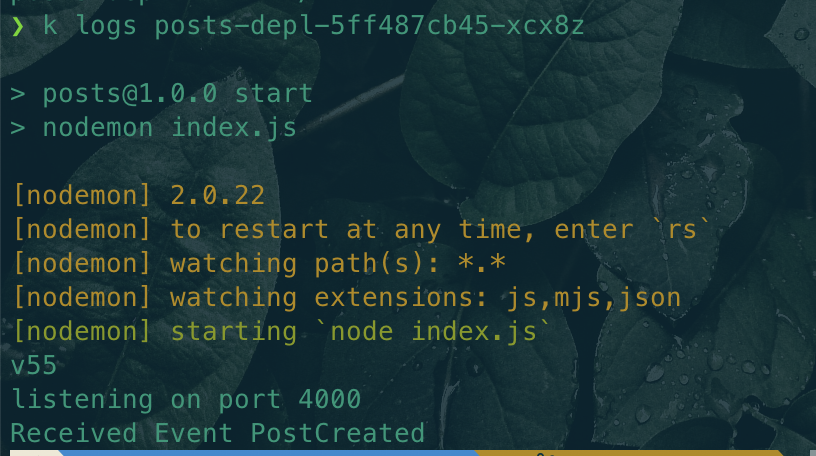
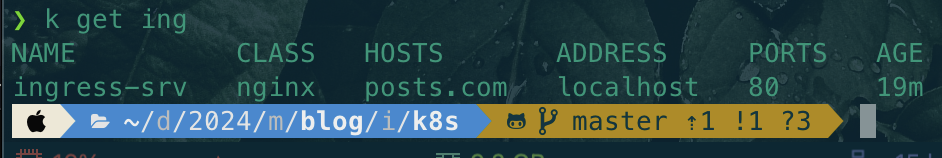
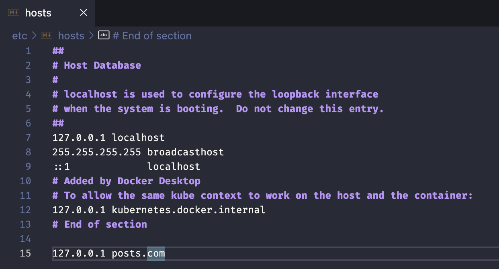
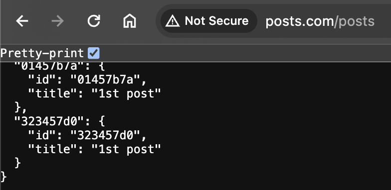

## Dockerrizing the Services
```bash
docker build .
docker run imageID

docker build -t tuwnguyen/posts .
docker run -it tuwnguyen/posts sh
docker exec -it 9a0c73a964bc sh
docker logs 28e1f2b13a94
```

## K8s Services
```bash
kubectl version
kubectl apply -f posts.yaml
kubectl get pods
kubectl exec -it posts sh
kubectl describe pod posts
```


Deployment
```bash
k apply -f posts-depl.yaml 
k apply -f . (apply all files)
k get deployments
k describe deployment posts-depl
k delete deployment posts-depl


```


Update Deployment
```bash
kubectl rollout restart deployment posts-depl
```



Services
```bash
k get services
```



Test communication between Services



Install Ingress-Nginx

https://kubernetes.github.io/ingress-nginx/deploy/#quick-start
```bash
kubectl apply -f https://raw.githubusercontent.com/kubernetes/ingress-nginx/controller-v1.10.1/deploy/static/provider/cloud/deploy.yaml
kubectl get ing
kubectl get services -n ingress-nginx

```


Hosts File Tweak
```bash
code /etc/host
```

